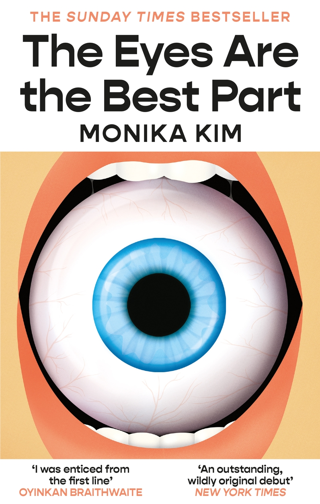

 
 

<figure class="book-cover">
  
</figure>

## Description

Ji-won’s life tumbles into disarray in the wake of her Appa’s extramarital affair and subsequent departure. Her mother, distraught. Her younger sister, hurt and confused. Her college freshman grades, failing. Her dreams, horrifying . . . yet enticing.

In them, Ji-won walks through bloody rooms full of eyes. Succulent blue eyes. Salivatingly blue eyes. Eyes the same shape and shade as George’s, who is Umma’s obnoxious new boyfriend. George has already overstayed his welcome in her family’s claustrophobic apartment. He brags about his puffed-up consulting job, ogles Asian waitresses while dining out, and acts condescending toward Ji-won and her sister as if he deserves all of Umma’s fawning adoration. No, George doesn’t deserve anything from her family. Ji-won will make sure of that.

For no matter how many victims accumulate around her campus or how many people she must deceive and manipulate, Ji-won’s hunger and her rage deserve to be sated.

A brilliantly inventive, subversive novel about a young woman unraveling, Monika Kim’s The Eyes Are the Best Part is a story of a family falling apart and trying to find their way back to each other, marking a bold new voice in horror that will leave readers mesmerized and craving more.
